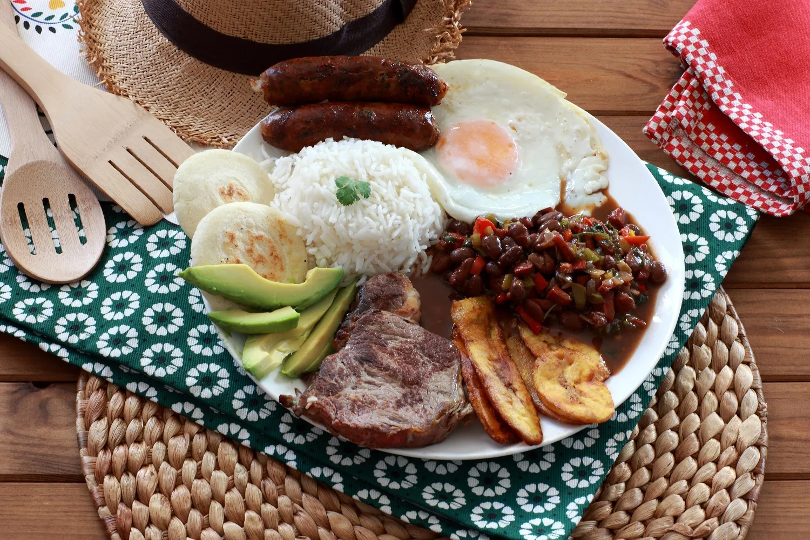

# bandeja paisa

La bandeja paisa es uno de los platos más populares de la cocina colombiana. Un plato abundante que incluye arroz, salchichas, huevos, carne de res, aguacate, chicharrón de cerdo, frijoles y arepas.

